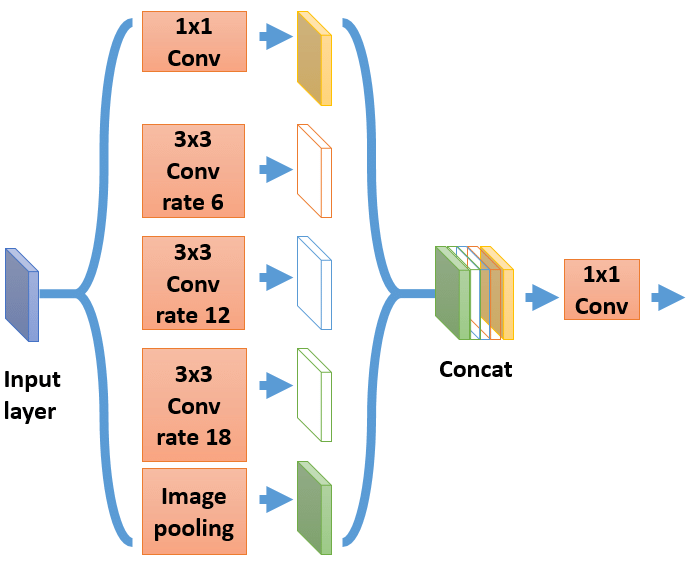
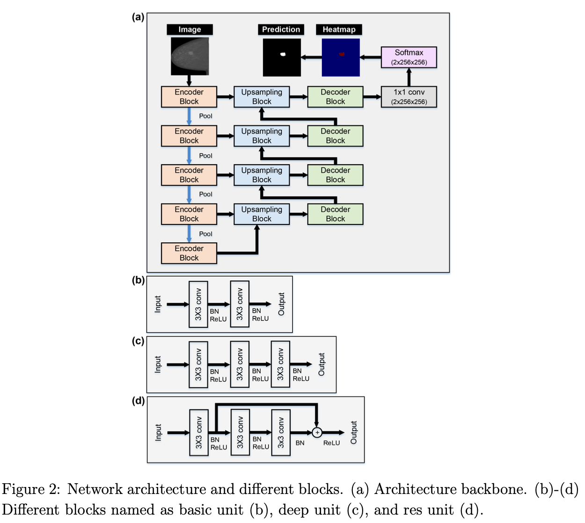
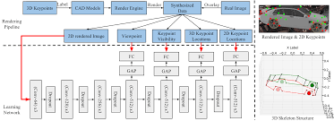
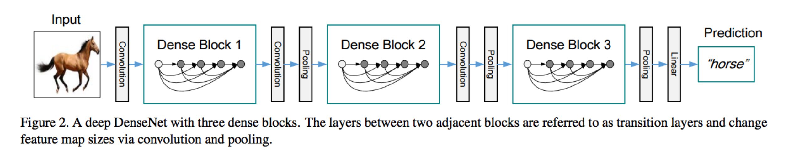
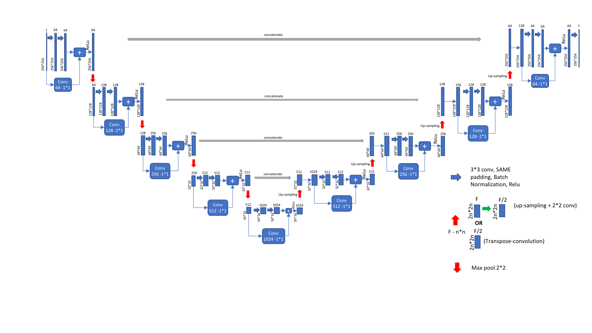

## Models

### The model implementation present in this repo :

1. #### ASPP Net (Atrous Spatial Pyramid Pooling)

   

2. #### Aunet (Attention-guided dense-upsampling networks)

   

3. #### Deep Supervision

   

4. #### Densely Connected Convolutional Networks

   

5. #### UNET with Residual Blocks

   

   